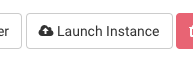
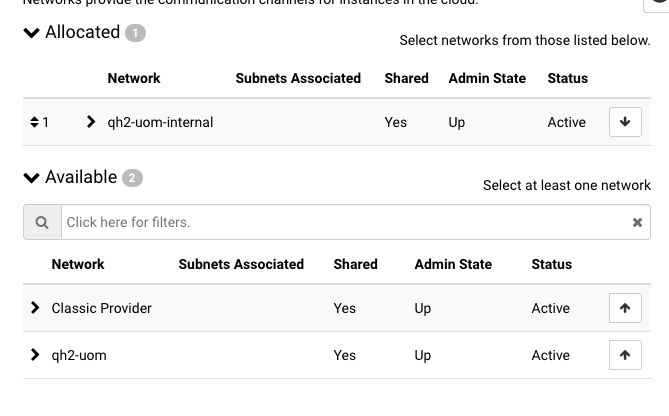
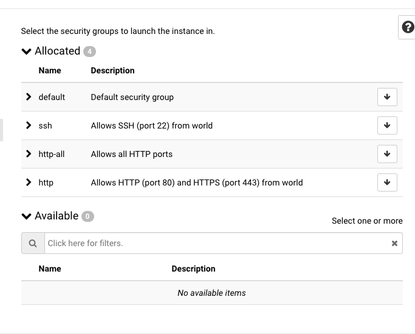
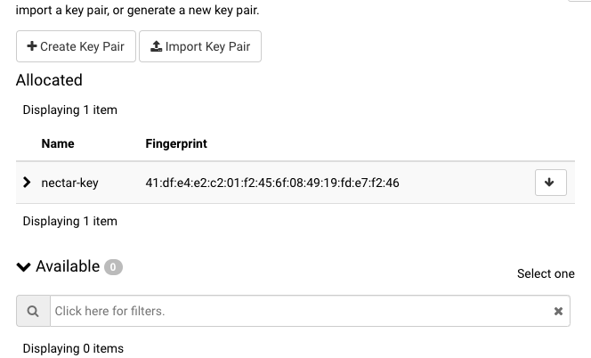
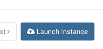
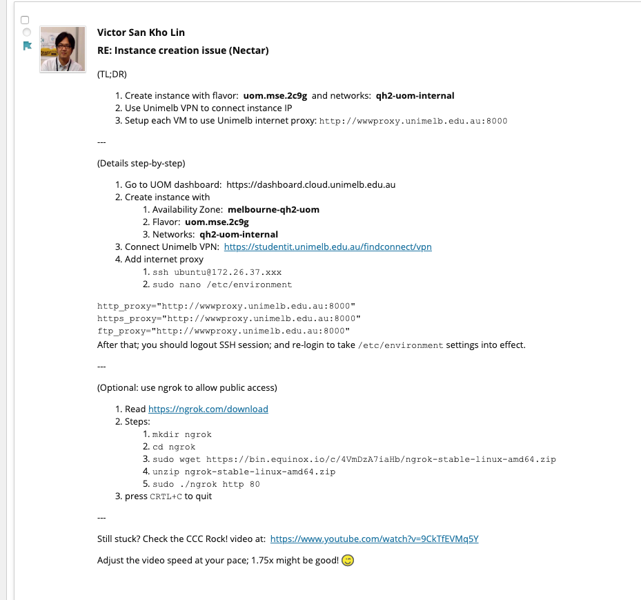
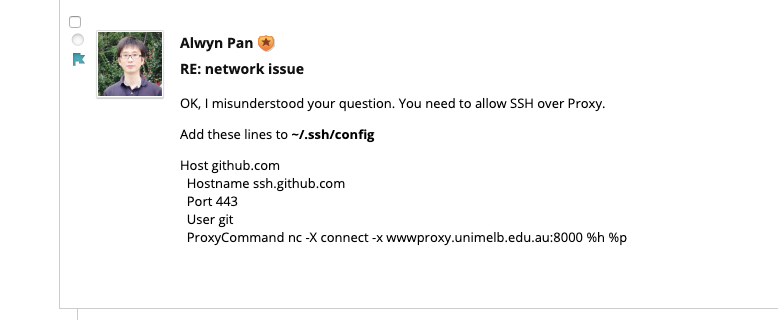

1. launch instance

2. source

3. flavor

4. networks

5. security groups

6. key pair

7. launch instance

8. proxy according to discussion board

9. install docker

<https://docs.docker.com/install/linux/docker-ce/ubuntu/>

10. docker proxy

<https://docs.docker.com/config/daemon/systemd/#httphttps-proxy>

11. docker pull couchdb

