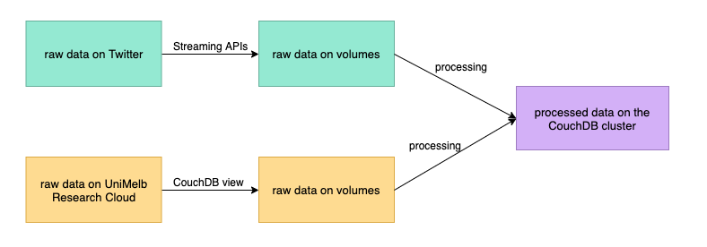

# System Deployment

We use Ansible and bash script to implement system deployment, including automatically building virtual machines and configuring system environment. The details are described below:

1. Generate ssh-key pair.
2. Create new security groups to allow HTTP and SSH traffic.
3. Launch four instances with certain instance source, flavour, internal networks, security groups and key pair. Three of the instances for grouping to a cluster for data processing, and one for running front-end and back-end.
4. Create three volumes, each for 80 Gigabytes. For each instance in the cluster, format one of the three volumes to ext4 format, and mount it to the data folder under the root path.
5. Modify ~/.ssh/config to allow ssh over proxy from GitHub, in order to clone and manager the repository for us.
6. Modify /etc/environment to use UniMelb internal proxy, including http_proxy, https_proxy and ftp_proxy for accessing public internet, and no_proxy for accessing localhost.
7. Make the file system, create a directory, and mount the volumes.
8. Install Docker.
9. Modify /etc/systemd/system/docker.service.d/http-proxy.conf for Docker container to use UniMelb internal proxy, which is similar to /etc/environment
10. For each instance, run the script \<script name\> to pull CouchDB:2.3.1 image, create and start the CouchDB container, modify the environment and the configuration inside the container to group the CouchDB containers on three separate instances into a cluster.

# Data Processing

After the CouchDB cluster has been built successfully, we are about to gather data and store them in the three volumes we created before. The data gathering process is described below:

1. Create an app on Twitter Developer, and get the Consumer API key, API secret key, access token, and access token secret.
2. Gather from two different sources. Note that data from the two different sources have different format, which should be handled separately.
   1. Write python programs to stream in data of the previous week from Twitter using the Twitter Streaming APIs. This part of code is under the folder **DataStreaming**.
   2. Use API provided to collect data of one year ago or earlier on the UniMelb Research Cloud.
3. Extract some useful information from the data, including the tweet text, tweet time, user information, and coordinates.
4. Do natural language processing on collected data to generate results.

The data flow is shown in the paradigm below.

# System Usage

